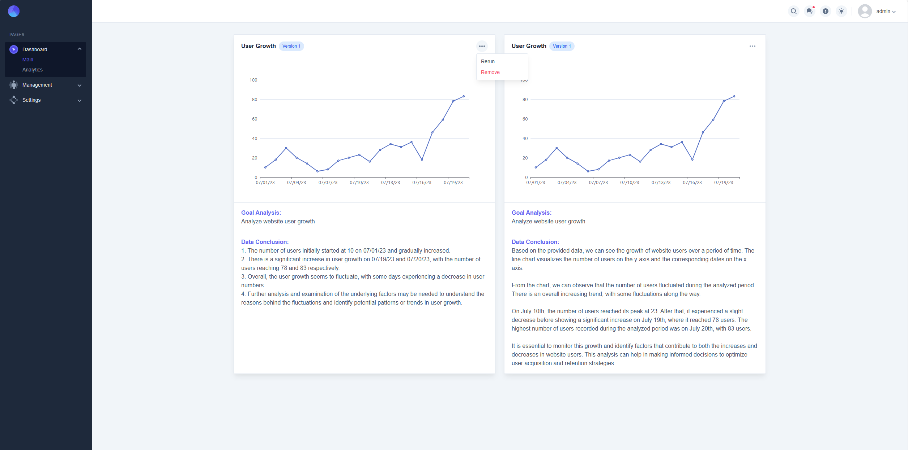

<h3 align="center">This project is ongoing🔥🔥🔥</h3>

<a href="https://glenncai.com">
  <picture>
    <source media="(prefers-color-scheme: dark)" srcset="assets/images/introduction-white.png">
    <source media="(prefers-color-scheme: light)" srcset="assets/images/introduction-dark.png">
    
  </picture>
  <h1 align="center">Open BI Platform</h1>
</a>

<p align="center">
  An open-source business intelligence platform based on microservice architecture.
</p>

<p align="center">
  <a href="#introduction"><strong>Introduction</strong></a> ·
  <a href="#architecture"><strong>Architecture</strong></a> ·
  <a href="#workflow"><strong>Workflow</strong></a> · 
  <a href="#setting-up-locally"><strong>Setting Up Locally</strong></a> ·
  <a href="#tech-stack"><strong>Tech Stack</strong></a> ·
  <a href="#license"><strong>License</strong></a>
</p>
<br/>

## Introduction

An open-source business intelligence platform based on microservice architecture. By leveraging ChatGPT technology,
users only need to import raw Excel data and enter their analysis requirements. The
system will then automatically generate visual charts and draw analytical conclusions, significantly reducing the cost
of manual data analysis.

<br />

## Architecture

<picture>
  <source media="(prefers-color-scheme: dark)" srcset="assets/images/open-bi-platform-architecture-white.svg">
  <source media="(prefers-color-scheme: light)" srcset="assets/images/open-bi-platform-architecture-dark.svg">
  
</picture>

<br />

## AI Analysis Workflow

<br />

## Setting Up Locally

### Prerequisites

Zipkin is used for distributed tracing. You can download the latest version of Zipkin from
the [official website](https://zipkin.io/pages/quickstart.html). I recommend using Docker to run Zipkin.

```shell
docker run -d -p 9411:9411 --name zipkin openzipkin/zipkin
```

## License

Licensed under
the [Apache-2.0 license](https://github.com/glenncai/open-bi-platform-backend-microservices/blob/main/LICENSE).