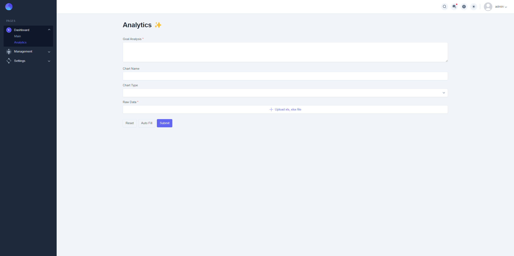
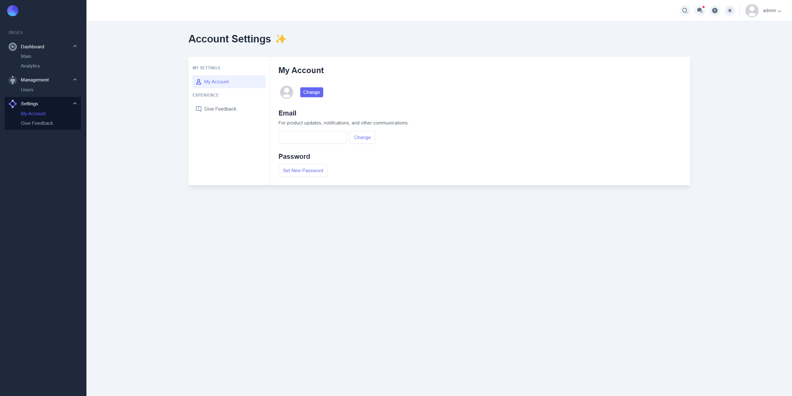

<h3 align="center">This project is ongoing🔥🔥🔥</h3>

<a href="https://glenncai.com">
  <picture>
    <source media="(prefers-color-scheme: dark)" srcset="assets/images/introduction-white.png">
    <source media="(prefers-color-scheme: light)" srcset="assets/images/introduction-dark.png">
    
  </picture>
  <h1 align="center">Open BI Platform</h1>
</a>

<p align="center">
  An open-source business intelligence platform based on microservice architecture.
</p>

<p align="center">
  <a href="#introduction"><strong>Introduction</strong></a> ·
  <a href="#architecture"><strong>Architecture</strong></a> ·
  <a href="#ai-analysis-workflow"><strong>AI Analysis Workflow</strong></a> · 
  <a href="#rabbitmq-workflow"><strong>RabbitMQ Workflow</strong></a> · 
  <a href="#open-ai"><strong>Open AI</strong></a> · 
  <a href="#tech-stack"><strong>Tech Stack</strong></a> ·
  <a href="#setting-up-locally"><strong>Setting Up Locally</strong></a> ·
  <a href="#project-overview"><strong>Project Overview</strong></a> ·
  <a href="#license"><strong>License</strong></a>
</p>
<br/>

Check [Frontend Source Code](https://github.com/glenncai/open-bi-platform-frontend) 👀 

Check [Python Poe Service Source Code](https://github.com/glenncai/open-bi-platform-poe-service) 👀 

## Introduction

An open-source business intelligence platform based on microservice architecture. By leveraging ChatGPT technology,
users only need to import raw Excel data and enter their analysis requirements. The
system will then automatically generate visual charts and draw analytical conclusions, significantly reducing the cost
of manual data analysis.

<br />

## Architecture

<picture>
  <source media="(prefers-color-scheme: dark)" srcset="assets/images/open-bi-platform-architecture-white.png">
  <source media="(prefers-color-scheme: light)" srcset="assets/images/open-bi-platform-architecture-dark.png">
  
</picture>

<br />
<br />

## AI Analysis Workflow

<picture>
  <source media="(prefers-color-scheme: dark)" srcset="assets/images/ai-analytics-workflow-white.png">
  <source media="(prefers-color-scheme: light)" srcset="assets/images/ai-analytics-workflow-dark.png">
  
</picture>

<br />
<br />

## RabbitMQ Workflow

<picture>
  <source media="(prefers-color-scheme: dark)" srcset="assets/images/rabbitmq-white.png">
  <source media="(prefers-color-scheme: light)" srcset="assets/images/rabbitmq-dark.png">
  
</picture>

<br />
<br />

## Open AI

This project uses the ChatGPT service provided by [Poe](https://poe.com/). I created
an [Open BI Platform Bot](https://poe.com/open-bi-platform) based on
ChatGPT 3.5 in Poe.
The user's input will be processed by the backend into `custom prompt` requirements for
the Open BI Platform Bot, and the
returned results include [Apache ECharts](https://echarts.apache.org/zh/index.html) `chart code`
and `data conclusion`.
Incredibly, with the support of custom
prompts, the
Open BI Platform Bot can generate result formats with up to 100% accuracy🔥. This means the chart code can be directly
used by the front end, **solving the problem that different data requires different charts and backends cannot handle
the
pain points of all cases**.

Besides, thanks to [snowby666](https://github.com/snowby666) for the open source Poe reverse engineering tool
[poe-api-wrapper](https://github.com/snowby666/poe-api-wrapper). Based on this tool, I
built a RESTful API for calling the Open BI Platform Bot. The API is written using Python and the Flask framework and
handles multiple requests in a multi-threaded manner. If you are interested, you can check out the
[open-bi-platform-poe-service](https://github.com/glenncai/open-bi-platform-poe-service) project.

<br />

Open BI Platform Bot Preview:

<picture>
  <source media="(prefers-color-scheme: dark)" srcset="assets/images/open-bi-platform-bot-white.png">
  <source media="(prefers-color-scheme: light)" srcset="assets/images/open-bi-platform-bot-dark.png">
  
</picture>

<br />
<br />

Code snippet calling the Open BI Platform Bot service:

```java
package com.glenncai.openbiplatform.aianalytics.manager;

import cn.hutool.core.lang.TypeReference;
import cn.hutool.json.JSONUtil;
import com.glenncai.openbiplatform.aianalytics.exception.enums.AiExceptionEnum;
import com.glenncai.openbiplatform.aianalytics.model.dto.ChatRequest;
import com.glenncai.openbiplatform.aianalytics.model.dto.ChatResponse;
import com.glenncai.openbiplatform.aianalytics.utils.HttpUtils;
import com.glenncai.openbiplatform.common.common.BaseResponse;
import com.glenncai.openbiplatform.common.constant.AiConstant;
import com.glenncai.openbiplatform.common.exception.BusinessException;
import lombok.extern.slf4j.Slf4j;
import org.springframework.stereotype.Service;

/**
 * Communicate with AI service (e.g. OpenAI, Google Bard, POE, etc.)
 *
 * @author Glenn Cai
 * @version 1.0 07/26/2023
 */
@Service
@Slf4j
public class AiManager {

  /**
   * Process AI chat
   *
   * @param chatRequest chat request body, including 'message' and 'key'
   * @return AI response
   */
  public String doAiChat(ChatRequest chatRequest) {
    String jsonStr = JSONUtil.toJsonStr(chatRequest);
    String result = HttpUtils.post(AiConstant.AI_API_URL, jsonStr);
    TypeReference<BaseResponse<ChatResponse>> typeRef = new TypeReference<>() {
    };

    BaseResponse<ChatResponse> response = JSONUtil.toBean(result, typeRef, false);
    if (response == null) {
      throw new BusinessException(AiExceptionEnum.AI_RESPONSE_ERROR.getCode(),
                                  AiExceptionEnum.AI_RESPONSE_ERROR.getMessage());
    }
    if (response.getCode() != 0) {
      throw new BusinessException(AiExceptionEnum.AI_RESPONSE_ERROR.getCode(),
                                  AiExceptionEnum.AI_RESPONSE_ERROR.getMessage());
    }

    return response.getData().getContent();
  }
}
```

In the future, I will integrate this AiManager into an SDK to facilitate the use of other projects.

<br />

Example of results returned by Open BI Platform Bot:


<br />
<br />

## Tech Stack

#### Backend

* Java
* Spring Boot
* Spring Cloud Gateway
* Spring Cloud Config
* Spring Cloud Circuit Breaker
* Spring Cloud Load Balancer
* Spring Cloud Sleuth
* Spring AOP
* Spring Cache
* Eureka
* OpenFeign
* RabbitMQ
* Redis
* MySQL
* MyBatis-Plus
* Zipkin
* Docker

#### Frontend

* Next.js
* React
* TypeScript
* Tailwind CSS
* Apache ECharts

#### Python AI service

* Python
* Flask
* poe-api-wrapper

<br />
<br />

## Setting Up Locally

#### For Microservices Backend:

1. Java 17
2. MySQL 8.0+
3. Redis
4. RabbitMQ
5. Zipkin

#### For Frontend:

1. Node.js 18.0+
2. npm 9.0+

#### For Python AI service:

1. Python 3.9

<br />

```shell
docker-compose -f docker-compose.env.yml up -d
```

```shell
docker-compose -f docker-compose.service.yml up -d
```

<br />
<br />

## Project Overview

Many APIs have been implemented on the backend, while the frontend still does not call these APIs. The project is still
in progress.

Authentication:


Dashboard:


AI Analytics:



User Management:


My Account:



Feedback:


Showing Responsive Design:


<br />
<br />

## License

Licensed under
the [Apache-2.0 license](https://github.com/glenncai/open-bi-platform-backend-microservices/blob/main/LICENSE).